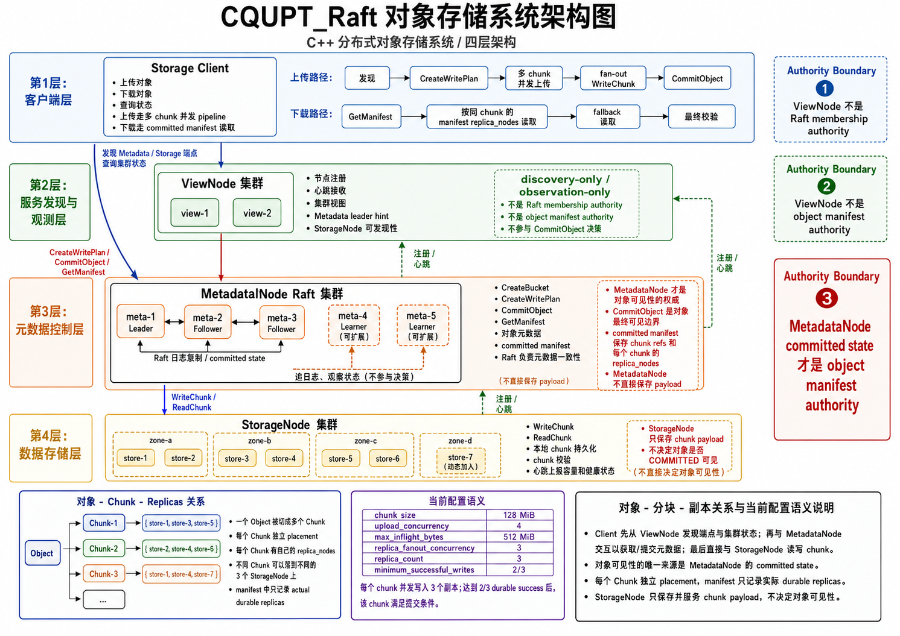
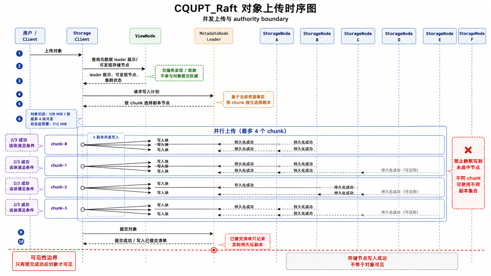
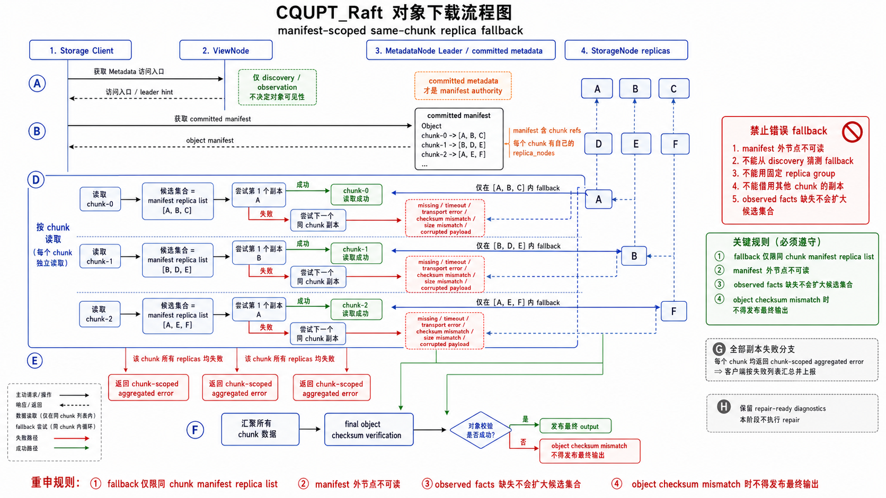
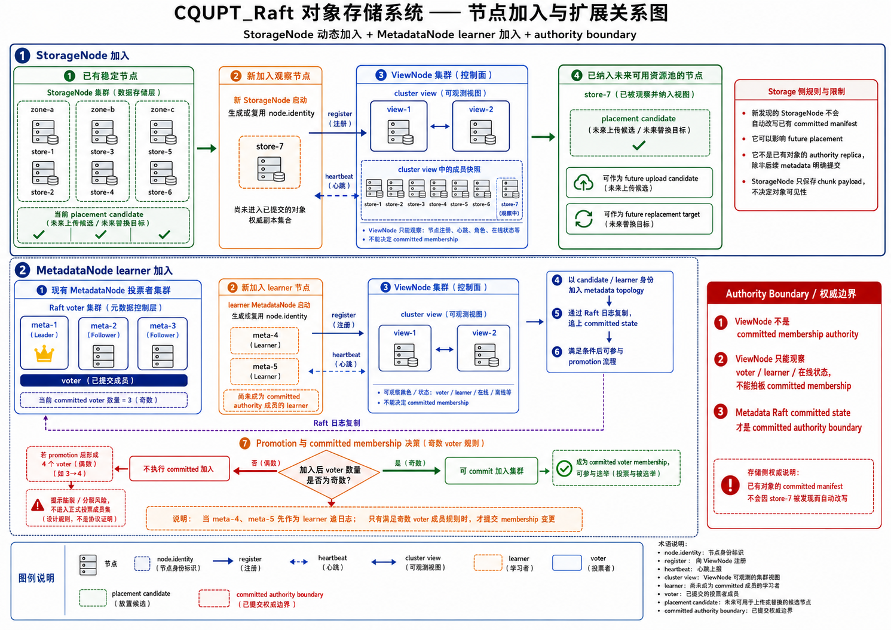
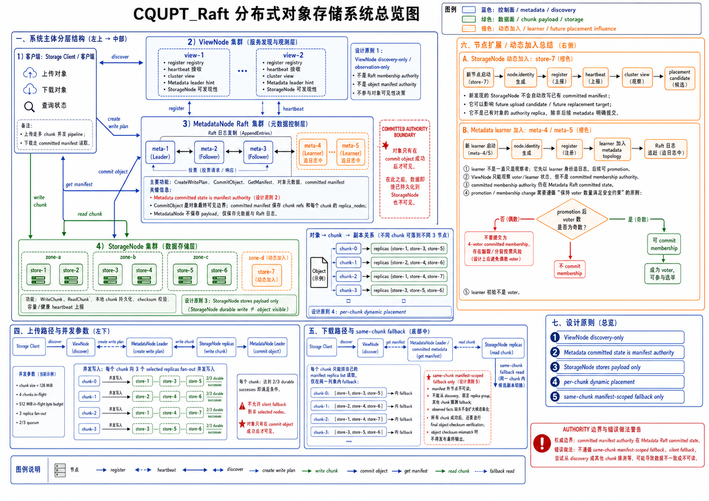

# CQUPT_Raft

这是一个基于 C++20、gRPC、Protobuf、GoogleTest 和 CMake 的分布式对象存储 / Raft 元数据系统。它不是把所有数据都塞进一致性层，而是采用更贴近工业系统的三层分工：

- `ViewNode` 负责服务发现与状态观测
- `MetadataNode` 负责 Raft 一致性元数据与对象可见性边界
- `StorageNode` 负责 chunk payload 的真实落盘、读取与本地持久化

系统当前重点已经从“能跑起来”推进到“工业化对象存储主路径”：

- 对象按 `128 MiB` 固定 chunk 切分
- upload 支持 `4` 个 chunk 并发进入 pipeline
- in-flight payload 预算为 `512 MiB`
- 每个 chunk 对 `3` 个 selected replicas 并发 fan-out 写入
- quorum 阈值为 `2 / 3`
- committed manifest 保存每个 chunk 的实际 durable replica facts
- download 严格依据 committed manifest 做同 chunk 副本 fallback

---

## 项目概览

这个项目的核心思想不是“谁在线就从谁读、谁能写就往谁写”，而是明确划分 authority boundary：

- `ViewNode` 只做 discovery-only / observation-only
- `MetadataNode committed state` 才是 object manifest authority
- `StorageNode durable write` 不等于对象已经成功上传
- `CommitObject` 才是对象最终可见性的边界

可以把整个系统理解成：

1. 客户端先通过 `ViewNode` 找到当前可访问的元数据和存储节点入口。
2. 客户端向 `MetadataNode` 请求 `CreateWritePlan`。
3. `MetadataNode` 为每个 chunk 基于实时资源事实做独立 placement。
4. 客户端并发把 chunk 写入多个 `StorageNode`。
5. 所有 chunk 满足 quorum 后，客户端再向 `MetadataNode` 发起 `CommitObject`。
6. 下载时，客户端先拿 committed manifest，再按每个 chunk 的 manifest replica list 读取和 fallback。

---

## 五张系统图

下面 5 张图位于 `docs/image/`，推荐按顺序阅读：

### 1. 系统架构



这张图适合理解整个系统的静态拓扑：

- 客户端如何与 `ViewNode`、`MetadataNode`、`StorageNode` 交互
- 三类节点分别处在哪一层
- authority boundary 在哪里
- 为什么 `ViewNode` 重要，但又不是最终权威

建议第一次看项目时先看这张图。

### 2. 上传



这张图重点解释 upload 主路径：

- 对象如何切分成多个 chunk
- 为什么每个 chunk 是独立 placement
- 为什么写入多个 `StorageNode` 后还不能立刻认为对象上传成功
- `CommitObject` 为什么是最终可见边界

如果你关注大文件并发上传、quorum、副本写入语义，这张图最关键。

### 3. 下载



这张图重点解释 download 主路径：

- 客户端如何先获取 committed manifest
- 为什么每个 chunk 只能在自己的 manifest replica list 里 fallback
- 为什么不能从 discovery 推断 manifest 外节点也可读
- 为什么最终还要做 object checksum 校验

如果你关注正确性和 read fallback，这张图最重要。

### 4. 补充节点



这张图用于理解节点加入和扩展：

- `store-7` 这类新 `StorageNode` 如何加入集群
- `meta-4`、`meta-5` 这类新 `MetadataNode learner` 如何加入
- learner 为什么默认不能直接参加选举
- 为什么新加入节点不会自动重写已有 committed manifest

如果你关注扩容、membership、动态节点，这张图最有帮助。

### 5. 分布式对象存储系统总览图



这张图适合做汇报、答辩或给新同学快速讲全系统：

- 节点关系
- 上传与下载主路径
- manifest authority
- same-chunk fallback
- 动态节点加入
- placement / quorum / committed 边界

如果你只想用一张图把项目讲清楚，优先用这张。

---

## 目录结构

项目中和对象存储主路径最相关的目录如下：

```text
apps/
  metadata_node_app.cpp
  storage_node_app.cpp
  view_node_app.cpp
  storage_client.cpp
  raft_metadata_client.cpp

modules/
  cluster/        集群配置、身份、cluster.json 加载校验
  view/           ViewNode 注册、心跳、发现、状态观测
  store/
    transfer/     upload / download 主路径
    placement/    副本选择与 placement 决策
    maintenance/  repair / scrub / rebalance 基础边界

examples/
  object-storage-local-009-simulated
  object-storage-local-010-config-parallel-simulated
  object-storage-local-3meta-6store

real_examples/
  object-storage-local-009-simulated
  object-storage-local-010-config-driven-simulated

docs/image/
  系统图与说明图
```

---

## 构建

推荐使用低并发调试预设：

```bash
cmake --preset debug-ninja-low-parallel
cmake --build --preset debug-ninja-low-parallel
```

更保守的构建方式：

```bash
cmake --preset debug-ninja-safe
cmake --build --preset debug-ninja-safe
```

---

## 测试

常用测试命令：

```bash
./test.sh
./test.sh --group unit
./test.sh --group persistence
./test.sh --group all
```

如果希望更稳，建议降低并发：

```bash
CTEST_PARALLEL_LEVEL=1 ./test.sh --group all
```

和对象存储主路径强相关的 target 通常包括：

```text
test_transfer_write_plan
test_storage_upload_integration
test_storage_read_integration
test_storage_scrub_repair
test_store_placement_manager
test_store_placement_policy
cluster_config_test
```

---

## 单机模拟怎么启动

这里的“单机模拟”不是单进程，而是“在一台机器上启动多个本地进程”，模拟一个小型对象存储集群。

推荐使用已经整理好的真实示例目录：

```text
real_examples/object-storage-local-010-config-driven-simulated
```

这个目录的特点是：

- 结构和 009 系列示例一致
- 配置由 `modules/config.json` 驱动生成
- 已验证支持大文件 upload / download
- 当前运行值是：
  - `chunk_size = 128 MiB`
  - `upload_concurrency = 4`
  - `max_inflight_bytes = 512 MiB`
  - `replica_fanout_concurrency = 3`

### 1. 生成配置

```bash
cd real_examples/object-storage-local-010-config-driven-simulated
./generate_cluster_config.sh
```

这会生成：

- `cluster.json`
- `storage-join-store-7.json`
- `metadata-learner-4.json`
- `metadata-learner-5.json`

### 2. 启动本地模拟集群

```bash
./qidong.sh
```

默认会启动：

- `2` 个 `ViewNode`
- `3` 个 `MetadataNode`
- `6` 个 `StorageNode`

即一个 `2 view + 3 meta + 6 store` 的本地模拟集群。

### 3. 查看集群状态

```bash
./rpc_demo.sh status
```

这个命令适合看：

- view / metadata / storage 当前是否 live
- Metadata leader hint
- cluster view 是否稳定

### 4. 做一次真实大文件上传 / 下载 roundtrip

```bash
./rpc_demo.sh parallel-roundtrip
```

这个命令会：

- 自动从 `tests/test_file` 中选取真实测试文件
- 优先选择 `1 GiB ~ 10 GiB` 内文件
- 如果没有，则选择最大的普通文件
- 自动完成：
  - create bucket
  - upload
  - download
  - 文件大小与完整性校验

当前已经验证通过的一次典型运行结果是：

- 真实文件：`tests/test_file/ok.zip`
- 文件大小：`538941586` 字节，约 `514 MiB`
- 上传成功
- 下载成功
- integrity = `PASS`

### 5. 动态加节点演示

动态加入一个新的 `StorageNode`：

```bash
./rpc_demo.sh join-storage
```

加入 `MetadataNode learner`：

```bash
./rpc_demo.sh join-metadata-learner
./rpc_demo.sh join-metadata-learner-2
```

观察 learner 的提升流程：

```bash
./rpc_demo.sh promote-metadata-learner
./rpc_demo.sh promote-metadata-learners
```

这里要注意：

- `meta-4`、`meta-5` 默认先以 learner 身份加入
- learner 先追平日志 / 快照
- 被写入 `committed membership` 后，才真正成为 voter
- 成为 voter 后，才有资格参与选举

### 6. 停止本地模拟集群

```bash
./tingzhi.sh
```

运行数据通常保存在：

- `logs/`
- `pids/`
- `downloads/`
- `nodes/`

如果希望完全清空本轮模拟环境，可以在停服后删除这些目录再重启。

---

## 一个主机进行模拟时，建议怎么做

推荐按下面顺序：

1. 先构建项目
2. 进入 `real_examples/object-storage-local-010-config-driven-simulated`
3. 运行 `./generate_cluster_config.sh`
4. 运行 `./qidong.sh`
5. 运行 `./rpc_demo.sh status`
6. 运行 `./rpc_demo.sh parallel-roundtrip`
7. 如需扩容演示，再执行：
   - `./rpc_demo.sh join-storage`
   - `./rpc_demo.sh join-metadata-learner`
   - `./rpc_demo.sh join-metadata-learner-2`
   - `./rpc_demo.sh promote-metadata-learners`
8. 最后执行 `./tingzhi.sh`

这一套流程适合：

- 开发环境本地联调
- 给新同学做系统讲解
- 做课程答辩 / 演示
- 复现 upload / download 主路径

---

## 多个主机进行实战怎么启动

当前仓库自带的 `examples/` 和 `real_examples/` 主要是“单机多进程模拟”模板。  
如果要做“多主机实战部署”，推荐沿用同一套节点职责与配置语义，但把每个节点拆到不同机器上部署。

### 推荐的最小多机拓扑

至少准备：

- 2 台机器运行 `ViewNode`
- 3 台机器运行 `MetadataNode`
- 6 台或更多机器运行 `StorageNode`
- 1 台客户端机器运行 `storage_client`

也可以在资源不足时合并角色，但更推荐职责分离：

- 机器 A：view-1
- 机器 B：view-2
- 机器 C：meta-1
- 机器 D：meta-2
- 机器 E：meta-3
- 机器 F~K：store-1 ~ store-6
- 机器 L：client / 运维入口

### 多机实战的启动原则

1. 每个节点必须有稳定的 `node_id`
- 不能频繁变更身份
- `node.identity` 要持久化保存

2. 每个节点都要使用一致的 cluster 配置视图
- 尤其是：
  - `cluster_id`
  - view endpoints
  - metadata endpoints
  - storage endpoints
  - raft membership
  - chunk policy
  - timeout policy

3. 启动顺序建议为：
- 先启动 `ViewNode`
- 再启动 `MetadataNode`
- 最后启动 `StorageNode`
- 最后再从客户端发起 upload / download

4. 生产环境要明确目录分离
- data dir
- snapshot dir
- logs
- pid / supervisor state

5. 节点之间网络要可达
- ViewNode 之间互通
- MetadataNode 之间互通
- StorageNode 能访问 ViewNode
- Client 能访问 ViewNode / Metadata leader / StorageNode

### 多机实战如何组织

推荐把单机模拟目录中的 `cluster.json` 生成逻辑抽出来，改为每台机器各自部署：

- `view_node_app --config <cluster.json> --node_id view-1 --data_dir ... --listen ...`
- `metadata_node_app --config <cluster.json> --node_id meta-1 --data_dir ... --listen ...`
- `storage_node_app --config <cluster.json> --node_id store-1 --data_dir ... --listen ...`
- `storage_client --config <cluster.json> ...`

也就是说，多机实战本质上不是换一套系统，而是把单机模拟中的：

- 同一个 `cluster.json`
- 不同 `node_id`
- 不同 `listen`
- 不同 `data_dir`

从“本机多进程”变成“多机单进程”。

### 多机实战建议操作顺序

推荐优先使用：

- `real_examples/object-storage-local-011-node-self-contained`

这套目录适合先在单机上模拟“多机分角色部署”，因为每个节点都有自己独立的：

- `start.sh`
- `stop.sh`
- `status.sh`
- `config.json`

建议按下面顺序操作：

1. 先停止旧节点，避免上一次残留进程、端口占用或脏状态影响本次验证。
2. 先启动两个 `ViewNode`：
   - `nodes/view-1/start.sh`
   - `nodes/view-2/start.sh`
3. 再启动三个 `MetadataNode`：
   - `nodes/meta-1/start.sh`
   - `nodes/meta-2/start.sh`
   - `nodes/meta-3/start.sh`
4. 等待 `Raft` leader 稳定后，再启动多个 `StorageNode`：
   - `nodes/store-1/start.sh`
   - `nodes/store-2/start.sh`
   - `nodes/store-3/start.sh`
   - `nodes/store-4/start.sh`
   - `nodes/store-5/start.sh`
   - `nodes/store-6/start.sh`
5. 对所有节点执行一次 `status.sh`，确认 `view / metadata / storage` 都已经运行。
6. 用 `storage_client status --config real_examples/object-storage-local-011-node-self-contained/cluster.json` 检查当前 view 视角下的 leader hint 和节点存活状态。
7. 先创建 bucket，再做上传下载。建桶时如果命中了非 leader `MetadataNode`，要根据 `leader hint` 切到真正 leader 重新执行。
8. 上传下载验证建议直接使用：
   - `tests/test_files/HKU-IS.rar`
   - `tests/test_files/总结.zip`
9. 上传完成后立刻做下载回读，并校验：
   - 文件大小是否一致
   - `sha256` 是否一致
10. 测试完成后，按相反顺序停止所有节点：
    - 先停 `StorageNode`
    - 再停 `MetadataNode`
    - 最后停 `ViewNode`
11. 如需扩容，再加入新的：
    - `StorageNode`
    - `MetadataNode learner`

一套可直接复用的本地模拟顺序如下：

```bash
cd real_examples/object-storage-local-011-node-self-contained

# 1. 停止旧节点
./nodes/store-6/stop.sh || true
./nodes/store-5/stop.sh || true
./nodes/store-4/stop.sh || true
./nodes/store-3/stop.sh || true
./nodes/store-2/stop.sh || true
./nodes/store-1/stop.sh || true
./nodes/meta-3/stop.sh || true
./nodes/meta-2/stop.sh || true
./nodes/meta-1/stop.sh || true
./nodes/view-2/stop.sh || true
./nodes/view-1/stop.sh || true

# 2. 启动 view
./nodes/view-1/start.sh
./nodes/view-2/start.sh

# 3. 启动 metadata
./nodes/meta-1/start.sh
./nodes/meta-2/start.sh
./nodes/meta-3/start.sh

# 4. 启动 storage
./nodes/store-1/start.sh
./nodes/store-2/start.sh
./nodes/store-3/start.sh
./nodes/store-4/start.sh
./nodes/store-5/start.sh
./nodes/store-6/start.sh

# 5. 查看状态
./nodes/view-1/status.sh
./nodes/view-2/status.sh
./nodes/meta-1/status.sh
./nodes/meta-2/status.sh
./nodes/meta-3/status.sh
./nodes/store-1/status.sh
./nodes/store-2/status.sh
./nodes/store-3/status.sh
./nodes/store-4/status.sh
./nodes/store-5/status.sh
./nodes/store-6/status.sh
```

推荐的上传下载验证命令如下：

```bash
build/linux/storage_client status \
  --config real_examples/object-storage-local-011-node-self-contained/cluster.json

build/linux/raft_metadata_client 127.0.0.1:9401 create-bucket \
  --request-id create-bucket-demo \
  --bucket example-bucket

build/linux/storage_client upload \
  --config real_examples/object-storage-local-011-node-self-contained/cluster.json \
  --bucket example-bucket \
  --object test-files-roundtrip/HKU-IS.rar \
  --file tests/test_files/HKU-IS.rar \
  --request-id upload-hku-is

build/linux/storage_client download \
  --config real_examples/object-storage-local-011-node-self-contained/cluster.json \
  --bucket example-bucket \
  --object test-files-roundtrip/HKU-IS.rar \
  --out real_examples/object-storage-local-011-node-self-contained/downloads/test-files-roundtrip/HKU-IS.rar \
  --request-id download-hku-is

build/linux/storage_client upload \
  --config real_examples/object-storage-local-011-node-self-contained/cluster.json \
  --bucket example-bucket \
  --object test-files-roundtrip/总结.zip \
  --file tests/test_files/总结.zip \
  --request-id upload-summary-zip

build/linux/storage_client download \
  --config real_examples/object-storage-local-011-node-self-contained/cluster.json \
  --bucket example-bucket \
  --object test-files-roundtrip/总结.zip \
  --out real_examples/object-storage-local-011-node-self-contained/downloads/test-files-roundtrip/总结.zip \
  --request-id download-summary-zip
```

如果 `create-bucket` 返回 `NOT_LEADER`，不要直接判定失败。应当根据返回的 `leader_hint_address`，改连当前 leader，例如：

```bash
build/linux/raft_metadata_client 127.0.0.1:9402 create-bucket \
  --request-id create-bucket-demo \
  --bucket example-bucket
```

### 多机实战要特别注意的几点

1. `ViewNode` 不是 authority
- 它只能帮助发现，不代表 committed truth

2. `MetadataNode committed state` 才是 authority
- object manifest
- object visibility
- membership committed facts

3. `StorageNode` 持久化成功不代表对象已可见
- 真正可见仍然依赖 `CommitObject`

4. 下载必须严格依据 committed manifest
- 不能从 discovery 推断 manifest 外节点也可读

5. 新加入节点不会自动改写旧对象 committed facts
- 新 `StorageNode` 只会影响未来 placement 或 future repair

---

## 案例建议

如果你想用这个项目做课程设计、演示、答辩或论文展示，推荐准备下面 4 个案例：

### 案例 1：基础上传下载

目标：

- 演示一个大文件对象如何完成 upload / download
- 强调 `CommitObject` 与 committed manifest

建议命令：

```bash
cd real_examples/object-storage-local-010-config-driven-simulated
./qidong.sh
./rpc_demo.sh parallel-roundtrip
./tingzhi.sh
```

### 案例 2：动态扩容 StorageNode

目标：

- 演示新 `StorageNode` 如何加入 cluster view
- 强调“影响 future placement，但不自动改写旧 manifest”

建议命令：

```bash
./rpc_demo.sh join-storage
./rpc_demo.sh status
```

### 案例 3：Metadata learner 加入与提升

目标：

- 演示 `meta-4` / `meta-5` 作为 learner 加入
- 强调 learner 默认不能直接参加选举
- 强调 committed membership 才能决定是否进入 voter 集合

建议命令：

```bash
./rpc_demo.sh join-metadata-learner
./rpc_demo.sh join-metadata-learner-2
./rpc_demo.sh promote-metadata-learners
```

### 案例 4：View failover 与 non-authority boundary

目标：

- 演示 view 失效不等于 metadata authority 消失
- 强调 view 是 discovery-only，不是 object authority

建议命令：

```bash
./rpc_demo.sh failover-view
./rpc_demo.sh status
```

---

## 系统理解时最容易犯的错误

请不要把这个系统理解成下面这些错误模型：

- “ViewNode 决定对象是否存在”
- “StorageNode 写成功就等于上传成功”
- “任何健康 StorageNode 都能拿来读旧对象”
- “所有 chunk 必须使用同一组副本”
- “learner 启动后就能参加选举”
- “新加入 store-7 会自动成为旧对象的 committed replica”

正确理解应该是：

- `ViewNode` 只做 discovery / observation
- `MetadataNode committed state` 才是 authority
- `StorageNode` 只存 payload
- `CommitObject` 决定对象可见性
- `download fallback` 只能发生在同 chunk 的 manifest replica list 内

---

## 推荐阅读顺序

如果你第一次接触这个仓库，建议按这个顺序：

1. 先看本 README
2. 再看 `docs/image/` 下的 5 张图
3. 再跑一遍 `real_examples/object-storage-local-010-config-driven-simulated`
4. 再读：
   - `apps/storage_client.cpp`
   - `apps/metadata_node_app.cpp`
   - `apps/storage_node_app.cpp`
   - `apps/view_node_app.cpp`
5. 然后再进入：
   - `modules/cluster/`
   - `modules/view/`
   - `modules/store/transfer/`
   - `modules/store/placement/`
   - `modules/store/maintenance/`

---

## 当前推荐入口

如果你现在就想快速体验项目，直接从这里开始：

```bash
cmake --preset debug-ninja-low-parallel
cmake --build --preset debug-ninja-low-parallel

cd real_examples/object-storage-local-010-config-driven-simulated
./generate_cluster_config.sh
./qidong.sh
./rpc_demo.sh parallel-roundtrip
./tingzhi.sh
```
这一条路径目前最接近“已经梳理清楚、适合演示、适合讲清系统结构”的版本。

## 客户端和服务端

### 服务器节点运行

- `view_node_app`  
  部署在 ViewNode，负责服务发现和节点状态观测。

- `metadata_node_app`  
  部署在 MetadataNode，负责 Raft 元数据服务。

- `storage_node_app`  
  部署在 StorageNode，负责 Chunk 数据读写。

### 用户电脑、测试机或运维机运行

- `storage_client`  
  对象存储客户端，用于上传、下载和查询状态。

- `raft_metadata_client`  
  元数据 RPC 客户端，用于 `create-bucket`、`list-objects`、`commit-object` 等调试、运维和验证操作。

### 其他

- `raft_demo`  
  用于 Raft 演示或实验，不作为正式对象存储多节点部署的主程序。

### 最简记忆

```text
服务器节点：
view_node_app
metadata_node_app
storage_node_app

客户端工具：
storage_client
raft_metadata_client

演示程序：
raft_demo
