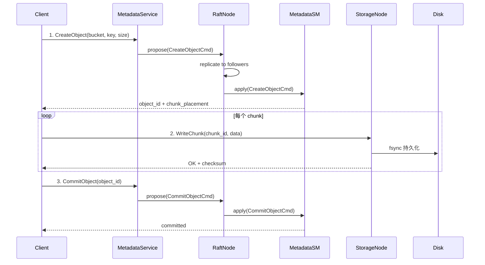

# CQUPT_Raft 项目全景图

基于 **C++20、gRPC、Protobuf、GoogleTest** 的 **Raft 一致性对象存储** 系统。

---

## 一、项目概览

| 维度 | 详情 |
|------|------|
| 语言 | C++20 |
| 构建系统 | CMake + Ninja |
| RPC 框架 | gRPC |
| 序列化 | Protobuf |
| 测试框架 | GoogleTest |
| 包管理 | vcpkg |
| 内核 | Raft 共识算法 |

### 构建命令

```bash
cmake --preset debug-ninja-low-parallel
cmake --build --preset debug-ninja-low-parallel
```

### 测试命令

```bash
./test.sh
./test.sh --group unit
./test.sh --group persistence
./test.sh --group all
CTEST_PARALLEL_LEVEL=1 ./test.sh --group all
```

---

## 二、目录结构

```
CQUPT_Raft/
├── CMakeLists.txt              # 根构建文件
├── CMakePresets.json           # CMake 预设
├── vcpkg.json                  # vcpkg 依赖清单
├── test.sh                     # 测试脚本
├── api.md                      # Java 客户端调用 RPC 说明
├── proto/                      # Protobuf/gRPC 契约层
│   ├── common.proto            # 公共消息（Status、Metrics）
│   ├── raft.proto              # Raft 共识 RPC
│   ├── metadata.proto          # 元数据服务 RPC
│   ├── storage_node.proto      # 存储节点 RPC
│   └── view.proto              # 集群视图 RPC
├── modules/
│   ├── raft/                   # Raft 内核（核心）
│   │   ├── common/             # 共享配置、命令编解码、提案
│   │   ├── metadata/           # 元数据类型定义
│   │   ├── node/               # RaftNode 核心状态与调度
│   │   ├── replication/        # 单 follower 复制状态机
│   │   ├── runtime/            # 日志、定时器、线程池
│   │   ├── service/            # gRPC 适配层
│   │   ├── state_machine/      # KV/元数据状态机
│   │   └── storage/            # 硬状态、segment log、快照持久化
│   ├── store/                  # 数据面存储
│   │   ├── chunk/              # Chunk 磁盘存储
│   │   ├── common/             # 存储类型定义
│   │   ├── index/              # Chunk 内存索引
│   │   ├── io/                 # 持久化文件 IO
│   │   ├── maintenance/        # GC、rebalance、repair、scrub
│   │   ├── node/               # StorageNode 服务与客户端
│   │   ├── placement/          # 放置策略与副本策略
│   │   ├── transfer/           # 跨节点数据传输
│   │   └── upload/             # 上传协调器
│   ├── cluster/                # 集群配置与节点身份
│   └── view/                   # 集群拓扑发现与注册
├── apps/                       # 可执行入口
│   ├── main.cpp                # 通用入口
│   ├── metadata_node_app.cpp   # Metadata 节点
│   ├── storage_node_app.cpp    # Storage 节点
│   ├── view_node_app.cpp       # View 节点
│   ├── raft_metadata_client.cpp # Metadata 客户端
│   └── storage_client.cpp      # Storage 客户端
├── tests/                      # 测试
├── specs/                      # 功能规格演进历史
└── docs/                       # 文档与图片
```

---

## 三、四条主线（按数据流理解）

### 线 1：Raft 共识线（内核）

```
RaftService (proto) → RaftNode → Replicator → RaftStorage / SnapshotStorage
```

| 子模块 | 路径 | 职责 |
|--------|------|------|
| `RaftNode` | `modules/raft/node/` | 系统心脏，管理 term、leader election、log replication、commit、apply |
| `Replicator` | `modules/raft/replication/` | 单个 follower 的 AppendEntries 复制状态机 |
| `RaftStorage` | `modules/raft/storage/` | 硬状态（term/votedFor）+ segment log 持久化 |
| `SnapshotStorage` | `modules/raft/storage/` | 快照 catalog 管理 |
| `RaftServiceImpl` | `modules/raft/service/` | gRPC 适配，桥接 RequestVote/AppendEntries/InstallSnapshot 到 RaftNode |
| 运行时 | `modules/raft/runtime/` | 日志、最小堆定时器、线程池 |

### 线 2：Metadata 元数据线（对象存储的"目录"）

```
MetadataService (proto) → MetadataStateMachine → MetadataCommand → RaftNode.propose()
```

| 子模块 | 路径 | 职责 |
|--------|------|------|
| `MetadataStateMachine` | `modules/raft/state_machine/` | 处理 bucket/object CRUD，支持快照 |
| `MetadataCommand` | `modules/raft/common/` | 命令编解码（CreateBucket、CreateObject、CommitObject 等） |
| 元数据类型 | `modules/raft/metadata/` | records、query、command types 定义 |
| `MetadataServiceImpl` | `modules/raft/service/` | 对外 gRPC 接口 |

### 线 3：Storage Node 数据面线（实际 chunk 存储）

```
StorageNodeService (proto) → StorageNodeService → ChunkStore → 本地磁盘
```

| 子模块 | 路径 | 职责 |
|--------|------|------|
| `StorageNodeService` | `modules/store/node/` | WriteChunk/ReadChunk 服务端 |
| `StorageNodeClient` | `modules/store/node/` | 客户端 stub |
| `LocalDiskChunkStore` | `modules/store/chunk/` | 本地磁盘读写 |
| `DurableFile` | `modules/store/io/` | `fsync` 持久化保证 |
| `ChunkIndex` | `modules/store/index/` | 内存索引快速查找 |
| `PlacementManager` | `modules/store/placement/` | chunk 放置策略、副本策略 |
| `UploadCoordinator` | `modules/store/upload/` | 协调分块上传流程 |
| `ObjectTransfer` | `modules/store/transfer/` | 跨节点 chunk 传输 |
| 维护组件 | `modules/store/maintenance/` | GC、rebalance、repair、scrub |

### 线 4：View / 集群发现线（拓扑感知）

```
ViewNodeService (proto) → ViewRegistry → ViewClient
```

| 子模块 | 路径 | 职责 |
|--------|------|------|
| `ViewRegistry` | `modules/view/` | 管理集群拓扑：哪些 metadata node、哪些 storage node |
| `ViewClient` | `modules/view/` | 客户端发现与心跳 |
| `ViewServiceImpl` | `modules/view/` | gRPC 服务实现 |
| `ClusterConfig` | `modules/cluster/` | JSON 集群配置解析 |
| `NodeIdentity` | `modules/cluster/` | 节点身份（ID、地址、角色） |

---

## 四、Proto 服务全景

### `raft.proto` — Raft 共识 RPC

```protobuf
service RaftService {
  rpc RequestVote(VoteRequest) returns (VoteResponse);
  rpc AppendEntries(AppendEntriesRequest) returns (AppendEntriesResponse);
  rpc InstallSnapshot(InstallSnapshotRequest) returns (InstallSnapshotResponse);
}
```

支持快速日志回溯（`last_log_index`、`conflict_term`/`conflict_index` hint）。

### `metadata.proto` — 元数据服务 RPC

```protobuf
service MetadataService {
  rpc CreateBucket(...) returns (...);
  rpc DeleteBucket(...) returns (...);
  rpc CreateObject(...) returns (...);
  rpc CommitObject(...) returns (...);
  rpc AbortObject(...) returns (...);
  rpc DeleteObject(...) returns (...);
  rpc HeadObject(...) returns (...);
  rpc ListObjects(...) returns (...);
  rpc JoinMetadataCluster(...) returns (...);
}
```

### `storage_node.proto` — 存储节点 RPC

```protobuf
// 包含 WriteChunk / ReadChunk / DeleteChunk 等
// 支持多种状态码（OK、NOT_FOUND、CHECKSUM_MISMATCH、DISK_FULL 等）
// 支持 chunk 状态机（STAGING → LIVE → DELETING → DELETED）
// 支持持久化级别（PUBLISH）
```

### `view.proto` — 集群视图 RPC

```protobuf
service ViewNodeService {
  rpc RegisterNode(...) returns (...);
  rpc HeartbeatNode(...) returns (...);
  rpc DiscoverMetadata(...) returns (...);
  rpc DiscoverStorage(...) returns (...);
  rpc GetClusterView(...) returns (...);
  rpc PullPeerViewSnapshot(...) returns (...);
  rpc PushPeerViewSnapshot(...) returns (...);
}
```

### `common.proto` — 公共消息

包含 `StatusResponse`、`HealthResponse`、`MetricsSnapshot`、`PeerReplicationProgress` 等。

---

## 五、上传一个对象的完整流程



---

## 六、`specs/` 项目演进历史

| 编号 | 主题 | 说明 |
|------|------|------|
| 003 | 持久化可靠性 | 硬状态、segment log、fsync 保障 |
| 004 | Raft 工业化 | RaftNode 核心调度、选举、复制 |
| 005 | 强一致性元数据层 | Metadata 状态机 + Raft 共识 |
| 006 | 移除 KV 状态机 | 精简，只保留 metadata 状态机 |
| 007 | Storage Node 数据面 | chunk 存储、索引、IO 层 |
| 008 | 集成对象存储系统 | 端到端上传/下载 |
| 009 | 本地 RPC 对象存储稳定化 | 可靠性、错误处理 |
| 010 | 对象存储配置工业化 | 集群配置、节点发现（当前） |

---

## 七、技术栈

| 组件 | 技术 |
|------|------|
| 语言标准 | C++20 |
| 构建 | CMake 3.20+ / Ninja |
| RPC | gRPC |
| 序列化 | Protobuf 3 |
| 测试 | GoogleTest + CTest |
| 包管理 | vcpkg |
| 平台 | Linux (x64) / Windows (x64) |
| 持久化 | fsync / segment log / snapshot |
| 并发 | 线程池 + 最小堆定时器 |

---

## 八、关键设计原则

1. **平台持久化不允许静默降级** — 每个平台必须提供等价持久化行为
2. **不允许 no-op 后直接返回成功** — durability 操作必须有真实语义
3. **头文件只放接口** — `.h` 放类型/接口/常量，`.cpp` 放实现/逻辑/IO
4. **模块最小化波及** — 改 `node` 要检查 `replication`、`storage`、`state_machine`
5. **测试不能跳过/删除** — 失败要分类并保留完整日志文件路径
