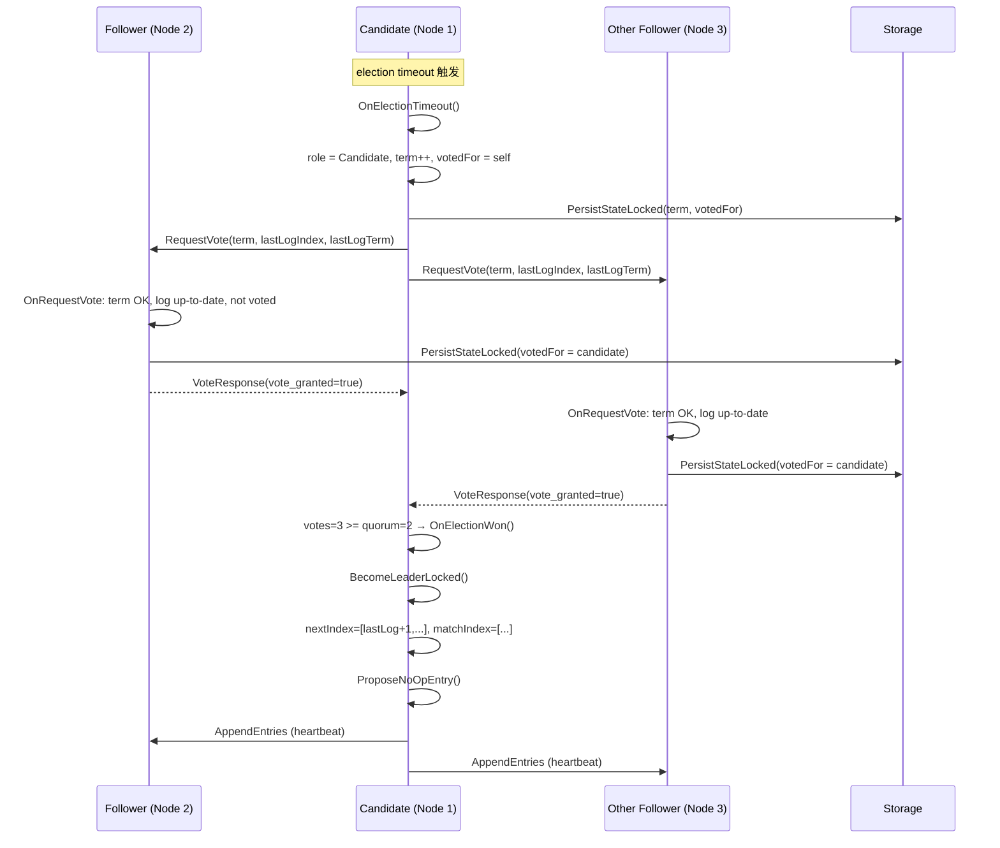
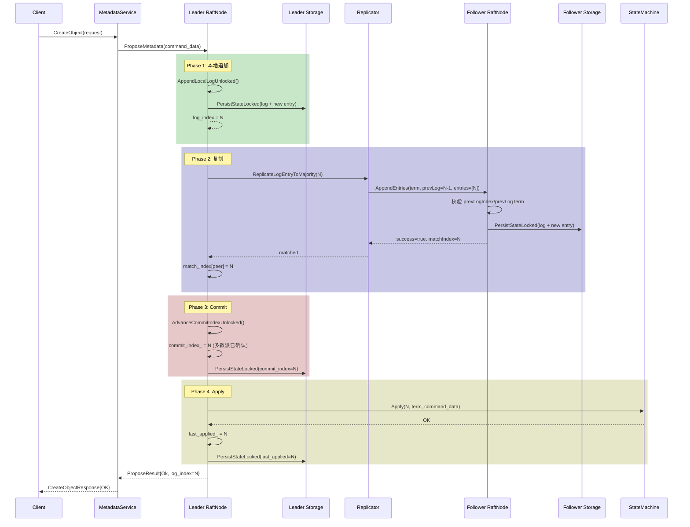
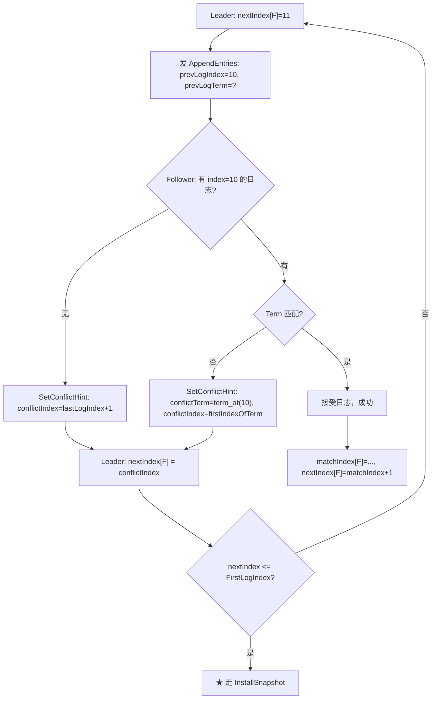
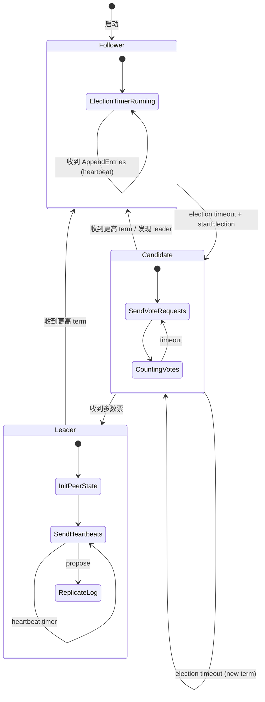
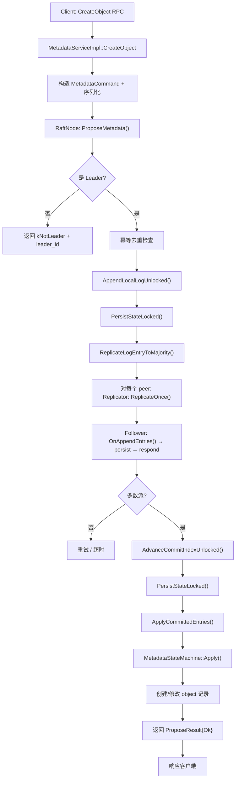
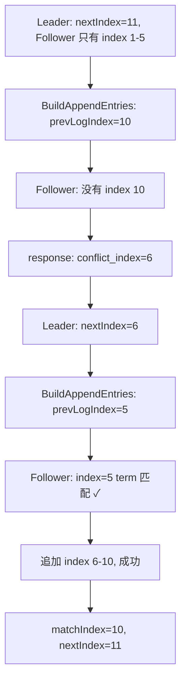

# CQUPT_Raft 内核源码深度分析

> 基于 `modules/raft/` 源码，从结构体到完整运行流程，打通 Raft 实现逻辑。

---

## 一、Raft 代码地图

### 1.1 文件索引

```
modules/raft/
├── common/                         # 共享类型与命令编解码
│   ├── config.h                    # NodeConfig, snapshotConfig, PeerConfig
│   ├── command.h                   # Command 命令封装（含序列化）
│   ├── propose.h                   # ProposeResult, ProposeStatus
│   ├── metadata_command.h/cpp      # MetadataCommand 编解码
│   └── metadata_result.h           # MetadataResult 统一返回
├── metadata/                       # 元数据类型
│   ├── metadata_command_types.h    # 枚举：操作类型、对象状态
│   ├── metadata_records.h          # BucketRecord, ObjectRecord 等
│   └── metadata_query.h            # HeadObjectQuery, ListObjectsQuery
├── node/                           # ★ Raft 核心
│   ├── raft_node.h                 # RaftNode 声明（~450 行）
│   └── raft_node.cpp               # RaftNode 实现（~4000 行）
├── replication/                    # ★ 单 follower 复制状态机
│   ├── replicator.h                # Replicator 声明
│   └── replicator.cpp              # Replicator 实现
├── runtime/                        # 基础设施
│   ├── logging.h                   # 日志宏
│   ├── min_heap_timer.h/cpp        # 最小堆定时器 (TimerScheduler)
│   └── thread_pool.h/cpp           # 线程池 (ThreadPool)
├── service/                        # gRPC 适配层
│   ├── raft_service_impl.h/cpp     # RaftService 实现
│   └── metadata_service_impl.h/cpp # MetadataService 实现
├── state_machine/                  # 状态机层
│   ├── state_machine_interface.h   # IStateMachine 接口
│   └── metadata_state_machine.h/cpp # MetadataStateMachine 实现
└── storage/                        # 持久化层
    ├── raft_storage.h/cpp          # 硬状态 + segment log
    └── snapshot_storage.h/cpp      # 快照 catalog
```

### 1.2 核心结构体一览

#### 1.2.1 RaftNode — 节点核心

```cpp
// 文件：modules/raft/node/raft_node.h:223-550

class RaftNode : public std::enable_shared_from_this<RaftNode> {
private:
    NodeConfig config_;                           // 配置（ID、地址、peer列表、超时等）
    snapshotConfig snapshot_config_;              // 快照配置

    mutable std::mutex mu_;                     // ★ 全局大锁（保护几乎所有 Raft 状态）
    Role role_{Role::kFollower};                // 角色：Follower/Candidate/Leader
    std::uint64_t current_term_{0};             // ★ 当前任期
    int voted_for_{-1};                         // ★ 本任期投票给谁，-1=未投票
    int leader_id_{-1};                         // 当前已知的 leader ID

    std::vector<LogRecord> log_;                // ★ 日志数组（内存中）
    std::uint64_t commit_index_{0};             // ★ 已提交的最大日志索引
    std::uint64_t last_applied_{0};             // ★ 已应用到状态机的最大索引

    std::uint64_t last_snapshot_index_{0};      // 最新快照包含的 last index
    std::uint64_t last_snapshot_term_{0};       // 最新快照包含的 last term

    // leader-only 状态
    std::unordered_map<int, std::uint64_t> next_index_;   // ★ 每个 peer 的下一条待发送索引
    std::unordered_map<int, std::uint64_t> match_index_;  // ★ 每个 peer 已复制的最大索引
    std::unordered_map<int, std::unique_ptr<Replicator>> replicators_; // 每个 peer 的复制器

    // gRPC 客户端连接池
    std::unordered_map<int, std::unique_ptr<PeerClient>> clients_;

    // 定时器
    TimerScheduler scheduler_;                  // 最小堆定时器
    std::optional<TimerScheduler::TaskId> election_timer_id_;
    std::uint64_t election_timer_generation_{0}; // 防止过期定时器回调
    std::optional<TimerScheduler::TaskId> heartbeat_timer_id_;
    std::optional<TimerScheduler::TaskId> snapshot_timer_id_;

    // 并发基础设施
    ThreadPool rpc_pool_{4};                    // RPC 发送线程池

    // gRPC 服务
    std::unique_ptr<RaftServiceImpl> service_;
    std::unique_ptr<MetadataServiceImpl> metadata_service_;
    std::unique_ptr<grpc::Server> server_;

    // apply 保护
    std::mutex apply_mu_;                       // Apply 互斥锁

    // 状态机
    std::unique_ptr<IStateMachine> state_machine_;    // ★ 业务状态机（MetadataStateMachine）
    std::unique_ptr<IRaftStorage> storage_;            // ★ 持久化存储
    std::unique_ptr<ISnapshotStorage> snapshot_storage_; // ★ 快照存储

    // 快照工作线程
    std::thread snapshot_worker_;
    bool snapshot_pending_{false};

    // 指标
    std::uint64_t election_count_{0};
    std::uint64_t leader_change_count_{0};
};
```

**角色枚举** (`raft_node.h:40-44`)：
```cpp
enum class Role { kFollower, kCandidate, kLeader };
```

#### 1.2.2 LogRecord — 日志条目

```cpp
// 文件：modules/raft/node/raft_node.h:47-51
struct LogRecord {
    std::uint64_t index;    // 日志索引（全局递增）
    std::uint64_t term;     // 创建此条目的任期
    std::string command;    // 命令数据（序列化后的业务命令）
};
```

#### 1.2.3 NodeConfig — 节点配置

```cpp
// 文件：modules/raft/common/config.h:19-38
struct NodeConfig {
    int node_id;
    std::string address;                    // 监听地址（如 0.0.0.0:50051）
    std::vector<PeerConfig> peers;          // 初始 peer 列表

    std::chrono::milliseconds election_timeout_min{300};  // 选举超时下限
    std::chrono::milliseconds election_timeout_max{600};  // 选举超时上限
    std::chrono::milliseconds heartbeat_interval{80};     // 心跳间隔
    std::chrono::milliseconds rpc_deadline{250};           // RPC 超时

    std::string data_dir;                   // 持久化目录
    ProposalLimits proposal_limits;         // 命令大小限制
};
```

#### 1.2.4 snapshotConfig

```cpp
// 文件：modules/raft/common/config.h:42-59
struct snapshotConfig {
    bool enabled{true};
    std::string snapshot_dir;
    std::uint64_t log_threshold{30};           // 新增 30 条日志触发快照
    std::chrono::milliseconds snapshot_interval{std::chrono::minutes(10)};
    std::size_t max_snapshot_count{5};
    bool load_on_startup{true};
    std::string file_prefix{"snapshot"};
};
```

#### 1.2.5 PersistentRaftState — 持久化状态

```cpp
// 文件：modules/raft/storage/raft_storage.h:11-17
struct PersistentRaftState {
    std::uint64_t current_term{0};          // ★ 必须持久化
    int voted_for{-1};                      // ★ 必须持久化
    std::uint64_t commit_index{0};          // 也持久化了
    std::uint64_t last_applied{0};          // 也持久化了
    std::vector<LogRecord> log;             // ★ 日志条目持久化
};
```

#### 1.2.6 ProposeResult — 提案结果

```cpp
// 文件：modules/raft/common/propose.h:16-30
struct ProposeResult {
    ProposeStatus status;         // kOk / kNotLeader / kTimeout / kReplicationFailed ...
    int leader_id{-1};
    std::uint64_t term{0};
    std::uint64_t log_index{0};
    std::string message;
};
```

#### 1.2.7 Replicator — 单 Peer 复制器

```cpp
// 文件：modules/raft/replication/replicator.h:32-72
class Replicator {
private:
    RaftNode &node_;
    PeerConfig peer_;
    ReplicationTargetRole target_role_;     // kVoter 或 kLearner
    mutable std::mutex mu_;

    bool append_inflight_{false};           // 是否有进行中的 AppendEntries
    bool snapshot_inflight_{false};         // 是否有进行中的 InstallSnapshot
    std::chrono::steady_clock::time_point next_retry_time_{};
    std::chrono::milliseconds retry_backoff_{20ms}; // 指数退避
    std::uint64_t transport_failures_{0};
};
```

#### 1.2.8 IStateMachine — 状态机接口

```cpp
// 文件：modules/raft/state_machine/state_machine_interface.h:39-58
class IStateMachine {
public:
    virtual ApplyResult Apply(uint64_t index, uint64_t term,
                              const std::string &command_data) = 0;
    virtual SnapshotResult SaveSnapshot(const std::string &file_path) const = 0;
    virtual SnapshotResult LoadSnapshot(const std::string &file_path) = 0;
};
```

---

## 二、Raft 启动流程调用链

### 2.1 入口到 RaftNode 创建

```
apps/metadata_node_app.cpp:main()
  ├── 解析 cluster_config.json → clusterdemo::ClusterConfig
  ├── 解析 node identity → clusterdemo::NodeIdentity
  ├── 构造 raftdemo::NodeConfig（填充 node_id、address、peers、data_dir 等）
  ├── 构造 raftdemo::snapshotConfig（填充 snapshot_dir、log_threshold 等）
  │
  └── auto node = std::make_shared<raftdemo::RaftNode>(
          node_config, snapshot_config, state_machine);
        │
        └── RaftNode 构造函数 (raft_node.cpp:438-540)
              ├── 1. 默认值填充（data_dir、snapshot_dir）
              ├── 2. ValidateNodeIdentity() —— 校验/创建 node_identity.txt
              ├── 3. storage_ = CreateFileRaftStorage(data_dir)
              ├── 4. snapshot_storage_ = CreateFileSnapshotStorage(snapshot_dir, prefix)
              ├── 5. storage_->Load() 加载持久化硬状态
              │     ├── 恢复 current_term_, voted_for_, commit_index_
              │     ├── 恢复 log_（日志数组）
              │     ├── last_applied_ = 0（强制从 0 开始重放）
              │     └── 检测快照标记日志（kSnapshotMarkerCommand）
              ├── 6. LoadLatestSnapshotOnStartup() —— 如果启用了快照
              │     ├── 遍历快照 catalog
              │     ├── state_machine_->LoadSnapshot(data.bin)
              │     ├── ResolveLoadedSnapshotAppliedBoundary()
              │     └── CompactLogPrefixLocked() + 更新 commit_index_/last_applied_
              └── 7. ApplyCommittedEntries() —— 重放 commit_index_ 之后的日志
```

### 2.2 Start() 调用链

```
node->Start()  (raft_node.cpp:559-582)
  ├── 1. rpc_pool_.Start()          —— 启动 RPC 发送线程池（4 线程）
  ├── 2. InitClients()              —— 为每个 peer 创建 gRPC channel + stub
  ├── 3. scheduler_.Start()         —— 启动定时器线程
  ├── 4. StartSnapshotWorker()      —— 启动快照异步线程
  ├── 5. InitServer()               —— 注册 RaftService + MetadataService 到 gRPC Server
  ├── 6. ResetElectionTimerLocked() —— 首次启动选举定时器
  └── 7. ResetSnapshotTimerLocked() —— 启动定时快照
```

### 2.3 关键初始化总结

| 步骤 | 位置 | 说明 |
|------|------|------|
| 配置来源 | `apps/metadata_node_app.cpp` → `cluster_config.json` | 解析 JSON 配置生成 `NodeConfig` |
| Peer 列表 | `NodeConfig::peers` | 来自配置文件，去重后使用 |
| 持久化加载 | `RaftNode 构造函数` → `storage_->Load()` | 恢复 `current_term`, `voted_for`, `commit_index`, `log` |
| 快照加载 | `LoadLatestSnapshotOnStartup()` | 遍历 catalog，加载最新有效快照 |
| 日志重放 | `ApplyCommittedEntries()` | 将 `last_applied+1` 到 `commit_index` 的日志 apply |
| 定时器启动 | `ResetElectionTimerLocked()` | 随机 300-600ms 超时 |
| gRPC 服务 | `InitServer()` | 注册 `RaftService` + `MetadataService` |
| 线程池 | `rpc_pool_` (4 线程) | 异步发送 RPC |

---

## 三、选举流程源码分析

### 3.1 选举触发

```
ResetElectionTimerLocked()                  // raft_node.cpp:1380-1393
  └── scheduler_.ScheduleAfter(timeout, [weak, gen] { OnElectionTimeout(gen); })
        │   timeout = RandomElectionTimeoutLocked()  // 300-600ms 随机
        │
        └── OnElectionTimeout(timer_generation)     // raft_node.cpp:1459-1484
              ├── 检查 running_ 和 role_
              ├── 检查 timer_generation（拒绝过期回调）
              └── StartElection()                    // raft_node.cpp:1508-1603
```

### 3.2 StartElection() 详细流程

```cpp
// raft_node.cpp:1508-1603
void RaftNode::StartElection() {
    // 1. 读取当前状态（last_log_index, last_log_term）
    // 2. 检查是否为 voter（非 voter 跳过选举）
    // 3. 记录指标：RecordElectionStarted()

    // 4. ★ 状态转换：Follower/Candidate → Candidate
    role_ = Role::kCandidate;
    ++current_term_;         // ★ term 自增
    voted_for_ = config_.node_id;  // ★ 投票给自己
    leader_id_ = -1;

    // 5. ★ 持久化硬状态（term + voted_for）
    if (!PersistStateLocked(&persist_error)) {
        // 恢复旧状态，放弃选举
        return;
    }

    // 6. 对每个 peer 异步发送 RequestVote RPC
    for (const auto &peer : peers) {
        rpc_pool_.Submit([...]{
            raft::VoteRequest request;
            request.set_term(term);
            request.set_candidate_id(config_.node_id);
            request.set_last_log_index(last_log_index);
            request.set_last_log_term(last_log_term);

            auto response = RequestVoteRpc(peer.node_id, request);
            // 收到回复后：
            //   - 如果 response.term > current_term → BecomeFollowerLocked()
            //   - 如果 vote_granted == true → votes++
            //   - 如果 votes >= quorum → OnElectionWon(term)
        });
    }
}
```

### 3.3 RequestVote 处理（接收端）

```cpp
// raft_node.cpp:2209-2266
void RaftNode::OnRequestVote(const VoteRequest &request, VoteResponse *response) {
    std::lock_guard<std::mutex> lk(mu_);

    // 1. 如果 request.term < current_term → 拒绝
    if (request.term() < current_term_) { return; }

    // 2. 如果 request.term > current_term → BecomeFollowerLocked()
    //    (更新 term, 清除 voted_for)
    if (request.term() > current_term_) {
        BecomeFollowerLocked(request.term(), -1, "received higher term");
    }

    // 3. 检查 voter 角色
    // 4. IsCandidateLogUpToDateLocked() —— 日志新旧比较
    //    先比较 last_log_term，再比较 last_log_index

    // 5. 检查 voted_for_ == -1 || voted_for_ == request.candidate_id()
    const bool can_vote = (voted_for_ == -1 || voted_for_ == request.candidate_id());

    // 6. 如果 can_vote && up_to_date → 投票 + PersistStateLocked()
    if (can_vote && up_to_date) {
        voted_for_ = request.candidate_id();
        if (PersistStateLocked(&persist_error)) {
            response->set_vote_granted(true);
            ResetElectionTimerLocked();  // ★ 重置选举超时
        } else {
            voted_for_ = old_voted_for;  // 持久化失败 → 撤回投票
        }
    }
}
```

### 3.4 成为 Leader

```cpp
// raft_node.cpp:1634-1670
void RaftNode::OnElectionWon(uint64_t term) {
    // 1. 检查 role_ == kCandidate && current_term_ == term
    // 2. BecomeLeaderLocked()
    // 3. ProposeNoOpEntry() —— ★ 发送 no-op 日志确立领导权
    // 4. SendHeartbeats() —— 立即发送心跳
}

// raft_node.cpp:1784-1810
void RaftNode::BecomeLeaderLocked() {
    role_ = Role::kLeader;
    leader_id_ = config_.node_id;
    CancelElectionTimerLocked();         // ★ 取消选举定时器

    // ★ 初始化 leader-only 状态
    next_index_.clear();
    match_index_.clear();
    match_index_[config_.node_id] = LastLogIndexLocked();
    next_index_[config_.node_id] = SafeAddOne(LastLogIndexLocked());
    for (const auto &peer : config_.peers) {
        next_index_[peer.node_id] = SafeAddOne(LastLogIndexLocked());  // 初始设为 leader 的 last+1
        match_index_[peer.node_id] = 0;
        GetOrCreateReplicatorLocked(peer);
    }

    ResetHeartbeatTimerLocked();         // ★ 启动心跳定时器
}
```

### 3.5 选举时序图



### 3.6 状态变化表

| 状态 | 触发条件 | term | votedFor | leaderId | 定时器 |
|------|----------|------|----------|----------|--------|
| Follower | 初始/收到更高 term | 不变或更新 | -1（新 term） | 设置 | election timer 运行 |
| Candidate | election timeout | +1 | self | -1 | election timer 运行 |
| Leader | 赢得选举 | 不变 | self | self | heartbeat timer 运行 |
| Follower (降级) | 收到更高 term 的 RPC | 更新为对方 term | -1 | 对方 | election timer 运行 |

---

## 四、日志复制流程源码分析

### 4.1 写请求进入点

```
客户端 → gRPC MetadataService.CreateObject()
  → MetadataServiceImpl::CreateObject()           // metadata_service_impl.cpp
    → 构造 MetadataCommand (CreateObjectCmd)
    → node_.ProposeMetadata(serialized_command)   // ★ 进入 Raft
      → ExecuteMetadataProposal()
        → Propose(Command{kMetadata, payload})
```

### 4.2 Propose 完整流程

```cpp
// raft_node.cpp:2798-2926
ProposeResult RaftNode::Propose(const Command &command) {
    // ========== 阶段 1：leader 本地追加日志 ==========
    {
        std::unique_lock<std::mutex> lk(mu_);
        // 检查 running_, role_ == kLeader
        // ValidateCommandUnlocked()
        // command_data = command.Serialize()

        log_index = AppendLocalLogUnlocked(command_data);
        //   ├── 创建 LogRecord{new_index, current_term_, command_data}
        //   ├── log_.push_back(record)
        //   ├── match_index_[self] = new_index
        //   ├── next_index_[self] = new_index + 1
        //   └── PersistStateLocked()  → ★ 持久化日志
    }

    // ========== 阶段 2：复制到多数派 ==========
    replicated = ReplicateLogEntryToMajority(log_index);
    //   ├── 循环：对每个 peer 调用 replicator->ReplicateOnce(term, log_index)
    //   ├── 检查 CountReplicatedCommittedVoters() >= majority
    //   └── 超时/丢 leadership 则返回失败

    // ========== 阶段 3：推进 commit ==========
    AdvanceCommitIndexUnlocked();
    //   从 last_log_index 向 commit_index_ 扫描
    //   找到满足 majority 且 term == current_term_ 的最大 index
    //   更新 commit_index_ + PersistStateLocked()

    // ========== 阶段 4：apply 到状态机 ==========
    ApplyCommittedEntries();
    //   while (last_applied_ < commit_index_):
    //       record = LogAtIndexLocked(last_applied_ + 1)
    //       state_machine_->Apply(index, term, record.command)
    //       last_applied_ = index
    //       PersistStateLocked()
}
```

### 4.3 AppendEntries 构造（Replicator 端）

```cpp
// replicator.cpp:220-280
bool Replicator::BuildAppendEntriesRequest(leader_term, request, should_install_snapshot) {
    auto &next_index = node_.next_index_[peer_id];

    // 如果 next_index <= leader 的 FirstLogIndex（日志已被 compact）
    //   → should_install_snapshot = true (走 InstallSnapshot)

    prev_log_index = next_index - 1;
    prev_log_term = node_.TermAtIndexLocked(prev_log_index);

    request->set_term(leader_term);
    request->set_leader_id(node_.config_.node_id);
    request->set_prev_log_index(prev_log_index);
    request->set_prev_log_term(prev_log_term);
    request->set_leader_commit(node_.commit_index_);

    // 从 next_index 开始填充日志条目（最多 256 条 / 512KB）
    for (index = next_index; index <= last_log_index && count < 256; ++index) {
        request->add_entries()->set_index/term/command(...);
    }
}
```

### 4.4 AppendEntries 处理（Follower 端）

```cpp
// raft_node.cpp:2270-2430
void RaftNode::OnAppendEntries(const AppendEntriesRequest &request,
                                AppendEntriesResponse *response) {
    // 1. term 检查：request.term < current_term → 拒绝
    // 2. term 更新：request.term > current_term → BecomeFollowerLocked()
    // 3. 日志一致性检查：
    //    a. prev_log_index 在快照之前？→ SetConflictHint (快照之后第一个 index)
    //    b. prev_log_index 不存在？  → SetConflictHint (last_log_index+1)
    //    c. prev_log_term 不匹配？   → SetConflictHint (conflict_term + first_index)
    //
    // 4. ★ 逐条处理 entries：
    for (entry in request.entries) {
        if (entry.index 处日志存在 && term 不匹配) {
            // ★ 冲突：截断日志（删除该 index 及之后所有条目）
            log_.resize(offset);
            log_changed = true;
        }
        // 追加新条目
        log_.push_back({entry.index, entry.term, entry.command});
        log_changed = true;
    }
    // 5. 如果 log_changed → PersistStateLocked()
    // 6. 如果 leader_commit > commit_index_
    //      commit_index_ = min(leader_commit, last_log_index)
    //      PersistStateLocked()
    //      should_apply = true
    // 7. 锁外 ApplyCommittedEntries()
}
```

### 4.5 日志复制时序图



---

## 五、Follower 追赶与日志冲突修复

### 5.1 冲突检测与修复流程

```
Leader 发送 AppendEntries
  ├── prevLogIndex = nextIndex[peer] - 1
  ├── prevLogTerm = leader.log[prevLogIndex].term
  │
  └── Follower 收到后：
        ├── prevLogIndex 不存在？
        │     → response.conflict_index = last_log_index + 1
        │     → response.conflict_term = 0
        │
        ├── prevLogTerm 不匹配？
        │     → response.conflict_term = term_at(prevLogIndex)
        │     → response.conflict_index = first_index_of_term(conflict_term)
        │
        └── Leader 收到失败响应：
              if (conflict_term != 0) {
                  // ★ 跳过整个冲突 term
                  next_index[peer] = leader 中该 term 最后一条的 index + 1
                  如果 leader 没有该 term → next_index = conflict_index
              } else if (conflict_index != 0) {
                  next_index[peer] = conflict_index
              } else {
                  next_index[peer] = last_log_index + 1
              }
```

### 5.2 HandleAppendEntriesResponse 详细

```cpp
// replicator.cpp:302-377
bool Replicator::HandleAppendEntriesResponse(...) {
    if (response.success()) {
        // ★ 成功：推进 match/next
        match_index[peer] = max(match_index, response.match_index);
        next_index[peer]   = max(next_index, response.match_index + 1);
        // 如果是 voter → AdvanceCommitIndexUnlocked()
        return match_index >= target_index;
    }

    // ★ 失败：使用 conflict 信息快速回退
    auto &next_index = node_.next_index_[peer_id];

    if (response.conflict_term() != 0) {
        // 在 leader 日志中反向查找同 term 的最后一条
        for (auto it = log_.rbegin(); it != log_.rend(); ++it) {
            if (it->term == response.conflict_term()) {
                hinted_next = it->index + 1;
                break;
            }
        }
        if (hinted_next == 0) {
            hinted_next = response.conflict_index(); // leader 没有该 term
        }
    } else if (response.conflict_index() != 0) {
        hinted_next = response.conflict_index();
    } else {
        hinted_next = response.last_log_index() + 1;
    }

    next_index = hinted_next; // ★ 快速跳回
}
```

### 5.3 SetAppendEntriesConflictHintLocked（Follower 端生成冲突信息）

```cpp
// raft_node.cpp:1965-1993
void RaftNode::SetAppendEntriesConflictHintLocked(probe_index, response) {
    response->set_last_log_index(LastLogIndexLocked());

    if (probe_index < last_snapshot_index_) {
        // 在快照之前 → 让 leader 从快照之后开始
        response->set_conflict_index(last_snapshot_index_ + 1);
        return;
    }

    if (!HasLogAtIndexLocked(probe_index)) {
        // 日志不够长 → 从最后一条之后开始
        response->set_conflict_index(LastLogIndexLocked() + 1);
        return;
    }

    // term 冲突 → 告知冲突 term 和该 term 的第一条 index
    const uint64_t conflict_term = TermAtIndexLocked(probe_index);
    response->set_conflict_term(conflict_term);
    response->set_conflict_index(FirstIndexOfTermLocked(conflict_term));
}
```

### 5.4 追赶流程图



### 5.5 具体例子

**场景**：Leader 日志 index 1-10（term 分别为 1,1,1,1,1, 2,2,2,2,2），Follower 日志 index 1-5（term 1,1,1,1,1）

```
1. Leader: nextIndex[F] = 11
2. Leader 发 AppendEntries(prevLogIndex=10, prevLogTerm=2)
3. Follower: 没有 index=10 → conflict_index = 6 (last_log_index+1)
4. Leader: nextIndex[F] = 6
5. Leader 发 AppendEntries(prevLogIndex=5, prevLogTerm=1)
6. Follower: index=5 term=1 匹配 → 追加 index=6~10
7. 成功
```

**场景**：Leader 日志 index 1-10（term 1,1,1,1,1, 2,2,2,2,2），Follower 日志 index 1-8（term 1,1,1,1,1, 3,3,3 —— index 6 处 term 冲突）

```
1. Leader: nextIndex[F] = 11
2. Leader 发 AppendEntries(prevLogIndex=10, prevLogTerm=2)
3. Follower: 没有 index=10 → conflict_index = 9
4. Leader: nextIndex[F] = 9
5. Leader 发 AppendEntries(prevLogIndex=8, prevLogTerm=2  ← leader 的 term 2)
6. Follower: index=8 存在但 term=3 ≠ 2
   → conflict_term = 3, conflict_index = firstIndexOfTerm(3) = 6
7. Leader: 在自己的日志中找 term=3 → 没有
   → hinted_next = conflict_index = 6
8. Leader: nextIndex[F] = 6
9. Leader 发 AppendEntries(prevLogIndex=5, prevLogTerm=1)
10. Follower: index=5 term=1 匹配
    → 截断 index=6 之后的日志（冲突的 term=3 条目）
    → 追加 leader 的 index=6~10
11. 成功
```

---

## 六、日志持久化与恢复机制

### 6.1 持久化状态表

| Raft 状态 | 是否持久化 | 存储位置 | 持久化时机 |
|-----------|-----------|----------|-----------|
| `current_term` | ✅ 是 | `meta.bin`（硬状态文件） | term 变化时 |
| `voted_for` | ✅ 是 | `meta.bin` | 投票时 |
| `commit_index` | ✅ 是（本项目） | `meta.bin` | commit 推进时 |
| `last_applied` | ✅ 是（本项目） | `meta.bin` | apply 每条日志后 |
| `log[]` | ✅ 是 | `log/segment_*.log` | 每次追加/截断日志后 |
| `role` | ❌ 否（内存） | — | 启动时总是 Follower |
| `leader_id` | ❌ 否（内存） | — | 从 RPC 学习 |

### 6.2 磁盘布局

```
{data_dir}/
├── node_identity.txt       # 节点身份校验（node_id）
├── node.identity           # 结构化身份（含 membership_state）
├── meta.bin                # ★ 硬状态：term, voted_for, commit_index, last_applied
├── meta.bin.tmp            # meta.bin 写入时的临时文件（原子替换）
└── log/
    ├── segment_00000000000000000001.log   # 第 1 个 segment（index 1-512）
    ├── segment_00000000000000000513.log   # 第 2 个 segment（index 513-...）
    └── ...
```

### 6.3 磁盘格式

**meta.bin**: 二进制格式
```
magic(4B "RMTA") | version(4B) | current_term(8B) | voted_for(4B) |
commit_index(8B) | last_applied(8B) | log_segment_count(8B) |
(first_log_index(8B), last_log_index(8B), segment_file_name(string))
× segment_count | log_entry_count(8B)
```

**segment_*.log**: 每条 entry:
```
magic(4B "RLOG") | version(4B) | index(8B) | term(8B) |
type(4B=1) | data_size(4B) | checksum(4B FNV-1a) | data(variable)
```

### 6.4 PersistStateLocked 实现

```cpp
// raft_node.cpp:3866-3886
bool RaftNode::PersistStateLocked(std::string *reason) {
    PersistentRaftState state;
    state.current_term = current_term_;
    state.voted_for = voted_for_;
    state.commit_index = commit_index_;
    state.last_applied = last_applied_;
    state.log = log_;               // ★ 全量写入
    return storage_->Save(state, reason);
}
```

**重要**：本项目持久化采用**全量覆盖**策略。每次 `PersistStateLocked()` 都写完整的 `meta.bin` + 所有 segment 文件。这是简化实现，适合中小规模日志；生产环境通常采用增量追加。

### 6.5 崩溃恢复调用链

```
RaftNode 构造函数
  ├── storage_->Load(&persistent_state, &has_state)
  │     ├── 读取 meta.bin → 恢复 term, voted_for, commit_index, last_applied
  │     ├── 读取 log/segment_*.log → 恢复 log_ 数组
  │     ├── ClampRecoveredHardState() → 校验边界
  │     └── 如果 log 为空且无快照 → 插入 bootstrap 条目 {0,0,"bootstrap"}
  │
  ├── LoadLatestSnapshotOnStartup()
  │     ├── 遍历快照目录，加载最新有效快照到状态机
  │     ├── CompactLogPrefixLocked() → 截断快照之前的日志
  │     └── 更新 commit_index_, last_applied_ 到快照边界
  │
  └── ApplyCommittedEntries()
        └── 从 last_applied_+1 到 commit_index_ 逐条 apply 日志到状态机
```

### 6.6 日志压缩（Log Compaction）

```
触发条件（MaybeScheduleSnapshotLocked）：
  ├── 定时触发：snapshot_interval (默认 10 分钟)
  └── 日志阈值触发：last_applied_ - last_snapshot_index_ >= log_threshold (默认 30)

快照流程（SnapshotWorkerLoop）：
  1. state_machine_->SaveSnapshot(temp_file) → 状态机序列化当前状态
  2. snapshot_storage_->SaveSnapshotFile(temp_file, index, term)
     → 发布到 snapshot_{index}/data.bin + __raft_snapshot_meta
  3. CompactLogPrefixLocked(index, term) → ★ 截断日志
     log_ = [{index, term, "snapshot"}, 后续日志...]
     last_snapshot_index_ = index
     last_snapshot_term_ = term
  4. PersistStateLocked() → 持久化压缩后的日志
  5. PruneSnapshots(5) → 保留最近 5 个快照
```

---

## 七、Raft 与对象存储业务层的关系

### 7.1 Raft 负责什么、不负责什么

| 层面 | Raft 负责 | Raft 不负责 |
|------|----------|-------------|
| **数据** | 元数据操作命令（bucket/object CRUD） | 实际 chunk 数据 |
| **一致性** | 元数据操作的线性一致性 | chunk 数据的最终一致性 |
| **复制** | 元数据命令的日志复制 | chunk 的副本放置（由 PlacementManager 负责） |
| **持久化** | 元数据日志 + 状态机快照 | chunk 数据的磁盘 IO（由 LocalDiskChunkStore 负责） |

### 7.2 业务请求到 Raft 的映射表

| 操作 | 走 Raft？ | 入口 | 说明 |
|------|----------|------|------|
| CreateBucket | ✅ 是 | `ProposeMetadata` | leader propose → commit → apply |
| DeleteBucket | ✅ 是 | `ProposeMetadata` | 同上 |
| CreateObject | ✅ 是 | `ProposeMetadata` | 创建对象元数据记录（PENDING 状态） |
| CommitObject | ✅ 是 | `ProposeMetadata` | 将对象状态从 PENDING → COMMITTED |
| AbortObject | ✅ 是 | `ProposeMetadata` | 将对象状态从 PENDING → DELETED |
| DeleteObject | ✅ 是 | `ProposeMetadata` | 标记对象为 DELETED |
| HeadObject | ❌ 否（读） | 直接读状态机 | 使用 `shared_mutex` 读锁 |
| ListObjects | ❌ 否（读） | 直接读状态机 | 同上 |
| WriteChunk | ❌ 否 | StorageNodeService | 直接写磁盘 |
| ReadChunk | ❌ 否 | StorageNodeService | 直接读磁盘 |

### 7.3 控制面 vs 数据面

```
控制面（走 Raft）：MetadataService → RaftNode → MetadataStateMachine
  - Bucket CRUD
  - Object 元数据 CRUD
  - 所有修改操作需要 leader propose → commit → apply

数据面（不走 Raft）：StorageNodeService → LocalDiskChunkStore
  - Chunk 写入/读取
  - 不需要 Raft 共识
```

### 7.4 Apply 流程

```cpp
// metadata_state_machine.cpp
ApplyResult MetadataStateMachine::Apply(index, term, command_data) {
    // 1. 解析 command_data → MetadataCommand
    // 2. 反序列化幂等去重检查
    // 3. 根据命令类型分派：
    switch (cmd.type) {
        case CreateBucketCmd:  /* 创建 bucket 记录 */  break;
        case DeleteBucketCmd:  /* 标记 bucket 为删除 */  break;
        case CreateObjectCmd:  /* 创建 object 记录 (PENDING) */ break;
        case CommitObjectCmd:  /* object 状态 → COMMITTED */ break;
        case AbortObjectCmd:   /* object 状态 → DELETED */  break;
        case DeleteObjectCmd:  /* 标记为 tombstone */ break;
    }
    // 4. 更新 last_applied_index_ / last_applied_term_
    // 5. 返回 ApplyResult{Ok}
}
```

**幂等性**：状态机通过 `request_id` 判断是否重复 apply，避免重复执行。

### 7.5 Leader 切换后业务层感知

```
Follower 检测到新 leader：
  OnAppendEntries(leader_id) → leader_id_ = request.leader_id()

业务层 Propose 到非 leader：
  Propose() → 检查 role_ != kLeader
  → 返回 ProposeResult{kNotLeader, leader_id=当前已知 leader}
  → 客户端根据 leader_id 重定向
```

---

## 八、推荐阅读路线

### 阶段 1：Raft 数据结构总览 (30 分钟)

| 文件 | 看的结构体 | 理解问题 |
|------|-----------|---------|
| `raft_node.h:40-44` | `Role` 枚举 | 三种角色的含义 |
| `raft_node.h:47-51` | `LogRecord` | 日志条目包含哪些字段 |
| `raft_node.h:223-550` | `RaftNode` 私有字段 | term, votedFor, log[], commitIndex, lastApplied, nextIndex, matchIndex 各是什么 |
| `config.h:19-38` | `NodeConfig` | 超时、心跳、peer 如何配置 |
| `raft_storage.h:11-17` | `PersistentRaftState` | 哪些字段必须持久化 |
| `propose.h:16-30` | `ProposeResult` | 提案返回什么信息 |
| `state_machine_interface.h:39-58` | `IStateMachine` | 状态机需要实现什么接口 |

**看完后应该能回答**：Raft 节点在内存中维护哪些核心字段？它们之间有什么关系？

### 阶段 2：节点启动和主循环 (30 分钟)

| 文件 | 看的函数 | 理解问题 |
|------|---------|---------|
| `raft_node.cpp:438-540` | `RaftNode::RaftNode()` | 持久化状态如何加载？快照如何恢复？ |
| `raft_node.cpp:559-582` | `RaftNode::Start()` | 定时器、gRPC、线程池分别在什么时候启动？ |
| `raft_node.cpp:700-718` | `RaftNode::InitServer()` | gRPC 注册了哪些服务？ |
| `raft_node.cpp:1380-1393` | `ResetElectionTimerLocked()` | 选举定时器如何设置？ |
| `raft_node.cpp:1405-1416` | `ResetHeartbeatTimerLocked()` | 心跳定时器如何设置？ |

**看完后应该能回答**：从 `main` 到 Raft 定时器开始运行，经历了哪些步骤？

### 阶段 3：选举流程 (45 分钟)

| 文件 | 看的函数 | 理解问题 |
|------|---------|---------|
| `raft_node.cpp:1459-1484` | `OnElectionTimeout()` | 超时回调如何防止过期？ |
| `raft_node.cpp:1508-1603` | `StartElection()` | term 何时增加？voteFor 何时设置？持久化在什么时候？ |
| `raft_node.cpp:2209-2266` | `OnRequestVote()` | 投票的 3 个条件是什么？ |
| `raft_node.cpp:1812-1819` | `IsCandidateLogUpToDateLocked()` | 日志新旧如何比较？ |
| `raft_node.cpp:1634-1670` | `OnElectionWon()` | 赢得选举后做什么？ |
| `raft_node.cpp:1784-1810` | `BecomeLeaderLocked()` | nextIndex/matchIndex 如何初始化？ |
| `raft_node.cpp:1784-1810` | `BecomeFollowerLocked()` | 何时降级为 Follower？做了什么清理？ |

**看完后应该能回答**：一个节点从 Follower → Candidate → Leader 的完整状态变化和所有持久化时机。

### 阶段 4：日志复制流程 (45 分钟)

| 文件 | 看的函数 | 理解问题 |
|------|---------|---------|
| `raft_node.cpp:2798-2926` | `Propose()` | 4 个阶段分别是什么？ |
| `raft_node.cpp:3342-3365` | `AppendLocalLogUnlocked()` | leader 如何追加本地日志？ |
| `raft_node.cpp:3367-3477` | `ReplicateLogEntryToMajority()` | 如何判断多数派？ |
| `replicator.cpp:220-280` | `BuildAppendEntriesRequest()` | AppendEntries 如何构造？何时走 snapshot？ |
| `raft_node.cpp:2270-2430` | `OnAppendEntries()` | follower 如何校验和处理日志？ |

**看完后应该能回答**：一条命令从 client 到状态机 apply 的完整路径。

### 阶段 5：Commit 和 Apply 流程 (30 分钟)

| 文件 | 看的函数 | 理解问题 |
|------|---------|---------|
| `raft_node.cpp:3479-3528` | `AdvanceCommitIndexUnlocked()` | commit 推进的 2 个条件？ |
| `raft_node.cpp:3530-3625` | `ApplyCommittedEntries()` | apply 循环如何工作？ |
| `metadata_state_machine.cpp` | `Apply()` | 业务命令如何执行？ |

**看完后应该能回答**：commit 和 apply 的区别？为什么 commit 要 leader term 匹配？apply 要 `apply_mu_`？

### 阶段 6：Follower 追赶和冲突修复 (30 分钟)

| 文件 | 看的函数 | 理解问题 |
|------|---------|---------|
| `raft_node.cpp:1965-1993` | `SetAppendEntriesConflictHintLocked()` | conflict_term/conflict_index 如何生成？ |
| `replicator.cpp:302-377` | `HandleAppendEntriesResponse()` | nextIndex 如何快速回退？ |
| `raft_node.cpp:2072-2190` | `SendInstallSnapshotToPeer()` | 何时走 InstallSnapshot？ |
| `raft_node.cpp:2435-2600` | `OnInstallSnapshot()` | follower 如何安装快照？ |

**看完后应该能回答**：落后 follower 如何在 O(N) 变成 O(1) 次 RPC 完成追赶？

### 阶段 7：持久化与快照 (30 分钟)

| 文件 | 看的函数 | 理解问题 |
|------|---------|---------|
| `raft_node.cpp:3866-3886` | `PersistStateLocked()` | 每次持久化写什么？ |
| `raft_storage.cpp` | `Save()` / `Load()` | 磁盘格式是什么？ |
| `raft_node.cpp:3655-3690` | `MaybeScheduleSnapshotLocked()` | 快照触发条件？ |
| `raft_node.cpp:3770-3855` | `SnapshotWorkerLoop()` | 快照流程是什么？ |
| `raft_node.cpp:3705-3765` | `LoadLatestSnapshotOnStartup()` | 启动时如何恢复快照？ |

### 阶段 8：Raft 与业务层整合 (30 分钟)

| 文件 | 看的函数 | 理解问题 |
|------|---------|---------|
| `metadata_service_impl.cpp` | `CreateObject()` 等 | gRPC 如何转到 Raft propose？ |
| `metadata_state_machine.cpp` | `Apply()` | 状态机如何执行命令？ |
| `raft_node.cpp:2928-3110` | `ProposeMetadata()` | 元数据提案的幂等去重和限流？ |

### 阶段 9：故障场景验证 (30 分钟)

| 测试文件 | 场景 |
|----------|------|
| `tests/raft_integration_test.cpp` | 基础 Raft 集成 |
| `tests/metadata_failover_test.cpp` | Leader 故障切换 |
| `tests/metadata_recovery_stress_test.cpp` | 崩溃恢复 |
| `tests/metadata_snapshot_test.cpp` | 快照恢复 |

---

## 九、推荐断点位置

| 断点位置 | 文件:行号 | 观察什么 |
|----------|----------|---------|
| 选举开始 | `raft_node.cpp:1530` (role_ = kCandidate) | term, votedFor 变化 |
| 投票决策 | `raft_node.cpp:2245` (can_vote 判断) | voted_for_, request 参数 |
| 成为 Leader | `raft_node.cpp:1784` (BecomeLeaderLocked) | nextIndex, matchIndex 初始化 |
| Leader 发心跳 | `raft_node.cpp:1673` (SendHeartbeats) | replicator 工作 |
| Propose 入口 | `raft_node.cpp:2800` (Propose) | 命令序列化 |
| 日志追加 | `raft_node.cpp:3345` (AppendLocalLogUnlocked) | log_ 变化 |
| 复制循环 | `raft_node.cpp:3390` (ReplicateLogEntryToMajority) | match_index_ 推进 |
| Commit 推进 | `raft_node.cpp:3498` (AdvanceCommitIndexUnlocked) | commit_index_ 变化 |
| Apply 执行 | `raft_node.cpp:3555` (ApplyCommittedEntries) | 状态机 Apply |
| 持久化 | `raft_node.cpp:3877` (PersistStateLocked) | PersistentRaftState |
| Follower 接收 | `raft_node.cpp:2270` (OnAppendEntries) | 日志追加/冲突处理 |
| 冲突修复 | `replicator.cpp:340` (HandleAppendEntriesResponse 失败分支) | nextIndex 回退 |
| 快照触发 | `raft_node.cpp:3670` (MaybeScheduleSnapshotLocked) | snapshot_pending_ |
| 快照压缩 | `raft_node.cpp:3825` (CompactLogPrefixLocked) | log_ 截断 |

---

## 十、你应该画出的 3 张图

### 图 1：Raft 节点状态图



### 图 2：写请求完整链路图



### 图 3：Follower 追赶流程图



---

## 十一、关键设计要点总结

1. **全局大锁 `mu_`**：几乎所有 Raft 状态操作都在 `mu_` 保护下，简化并发但影响吞吐。
2. **全量持久化**：每次 `PersistStateLocked()` 写完整状态，实现简单但效率较低。
3. **快速日志回溯**：使用 `conflict_term` + `conflict_index` 实现 O(1) 次 RPC 回退，而非逐条递减。
4. **幂等去重**：Metadata 层通过 `request_id` + `fingerprint` 实现 proposal 级别的幂等去重。
5. **快照与日志分离**：快照通过单独线程异步执行，不阻塞 Raft 主循环。
6. **Learner 支持**：通过 `PendingAddLearnerProposal` + 原子 batch promote 实现安全的成员变更。
7. **调度器代际**：`election_timer_generation_` 防止过期的定时器回调触发错误的选举。

---

## 十二、推荐测试用例

| 测试 | 验证什么 |
|------|---------|
| `raft_integration_test.cpp` | 基础选举 + 日志复制 |
| `metadata_failover_test.cpp` | Leader 故障 + 新 Leader 选举 |
| `metadata_recovery_stress_test.cpp` | 崩溃恢复 + 日志重放 |
| `metadata_snapshot_test.cpp` | 快照创建 + 恢复 + 截断 |
| `persistence_test.cpp` | 持久化读写正确性 |
| `persistence_more_test.cpp` | 持久化边界场景 |
